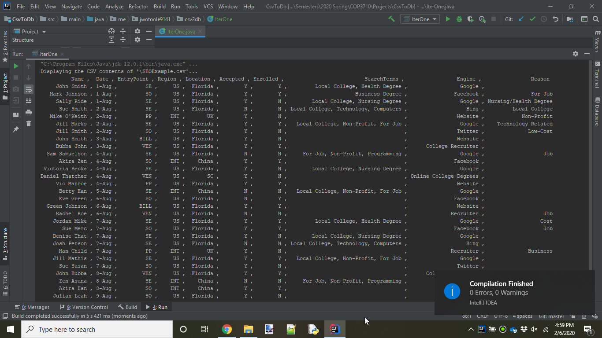
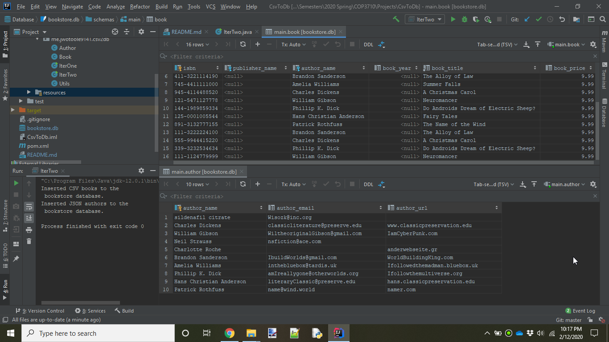

# CsvToDb

This is a project for Prof. Greenwell's COP3710 Intro to Data Engineering 
course at Florida Gulf Coast University, Spring 2020

## Iteration 1: Data Flow Operations

> Create a Maven project with OpenCSV working & read & print the contents of a file (an action called parsing).

## Iteration 2: Data Flow Operations

> Iteration 2: Add JDBC & GSON to your Maven project, read the contents of a CSV, and insert this into the provided database.
  You will need to insert into "author" from the json file (the three fields in the json file)
  And "book" with some of the information from the csv file (see bottom)

